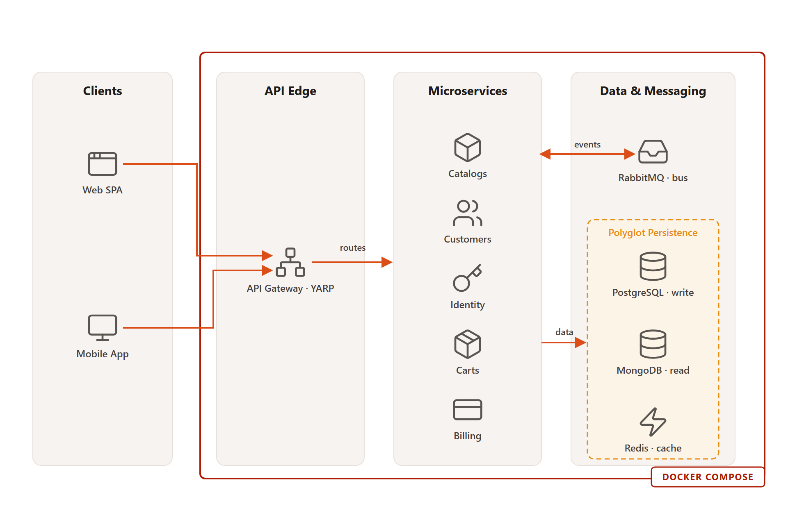
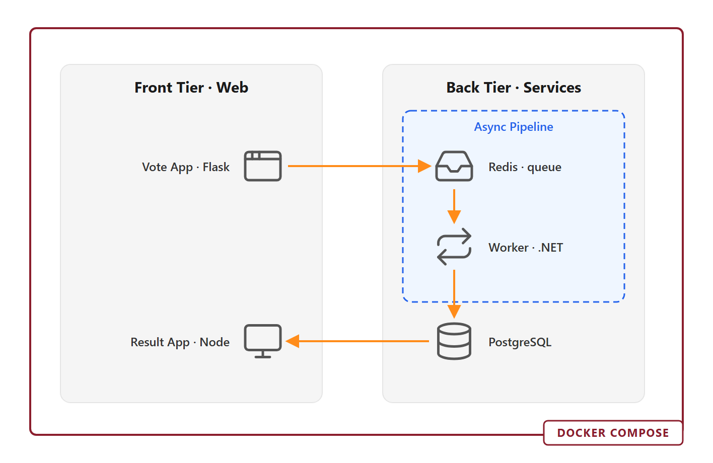
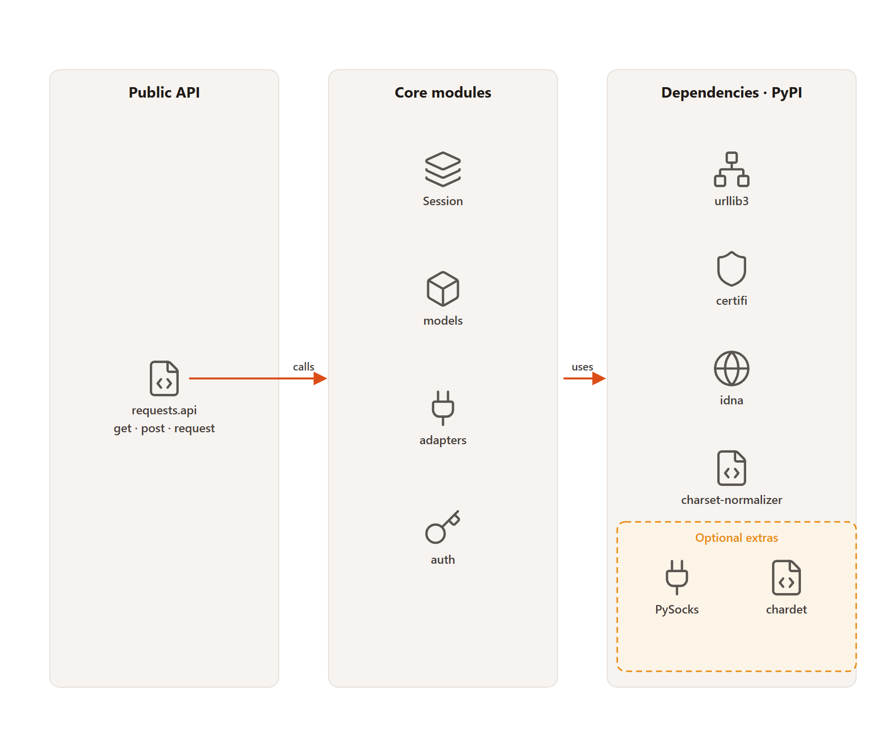

# mighty-diagram

<p align="center">
  <a href="https://github.com/kjchen93/mighty-diagram/releases"></a>
  <a href="https://www.npmjs.com/package/mighty-diagram-cli"></a>
  <a href="LICENSE"></a>
  
</p>

<p align="center">
  <a href="https://www.npmjs.com/package/mighty-diagram-cli"></a>
  <a href="https://github.com/kjchen93/mighty-diagram/stargazers"></a>
</p>

An **AI skill** that turns any code repository into a clean, minimalist technical **architecture
diagram** — as a self-contained **SVG**, with nothing to install to view or render it.

<p align="center">
  
</p>

<p align="center"><i>Generated from a real microservices repo. See the <a href="examples/">gallery</a>.</i></p>

## Why

- **Repo-grounded** — it reads your `docker-compose`, manifests, Dockerfiles, k8s/IaC, `.env`, CI and directory structure, then diagrams what's actually there (no invented services).
- **Three views** — **component/architecture** (default), **tech-stack**, or **user-workflow**. It proposes the best fit and lets you switch.
- **Clean by construction** — hand-authored SVG in a swimlane grid: titled group columns, monochrome line icons, flow arrows, optional deployment frame and dashed sub-groups.
- **Zero runtime dependency** — the output is one `.svg`; icons are inlined, so it renders in any browser, on GitHub, in docs, offline, and on every AI surface.
- **Your colors** — defaults to the **PwC** brand palette; recolor everything by editing one `:root` block, or pick a preset (`pwc`, `reference`, `monochrome`, `ocean`, `forest`, `violet`).

## Gallery

| Microservices (PwC) | Web app (reference palette) | Library — no frame (PwC) |
|---|---|---|
| [](examples/microservices-food-delivery.svg) | [](examples/web-app-voting.svg) | [](examples/library-requests.svg) |

More detail in [`examples/`](examples/).

## Install

### 1. Claude Code — plugin marketplace (one-liner)

```
/plugin marketplace add kjchen93/mighty-diagram
/plugin install mighty-diagram@mighty-diagram
```

### 2. CLI — any AI assistant

```bash
npm install -g mighty-diagram-cli

mighty-diagram init --ai claude            # current project
mighty-diagram init --ai claude --global   # all projects (~/.claude/skills)
mighty-diagram list                        # see all supported platforms
```

Supports Claude Code (verified) plus Cursor, Windsurf, Copilot, Codex, Gemini, OpenCode,
Continue, Droid, KiloCode, Roo Code, Qoder, Warp, Augment, Antigravity, CodeBuddy, Kiro, Trae.
See [`cli/`](cli/).

### 3. Manual

```bash
git clone https://github.com/kjchen93/mighty-diagram
cp -r mighty-diagram/skills/mighty-diagram ~/.claude/skills/   # or .claude/skills/ in a project
```

## Usage

Just ask, in any repo:

```
Diagram this repository.
Draw the architecture of this codebase.
Show me the tech stack as a diagram.
Visualize the main user workflow.
```

Or invoke it directly with `/mighty-diagram`. The skill scans the repo, proposes a view + palette
(asking once), and writes `architecture.svg`. Embed it in your README with ``.

## Views

| View | Use when |
|------|----------|
| Component / architecture (default) | services, datastores, queues + data flow; or a monolith's internals |
| Tech stack | libraries, CLIs; "what's in here" |
| User workflow | a clear primary user journey through routes/entrypoints |

## How it works

```
scan repo  →  facts inventory  →  explain  →  map (groups/nodes/edges)  →  author SVG  →  self-check
(grounded in real files)        (plain English)   (≤ ~25 nodes)          (lane grid + icons)
```

The skill instructions and bundled knowledge live in [`skills/mighty-diagram/`](skills/mighty-diagram/):
`SKILL.md`, `references/` (repo-analysis, style-system, svg-authoring, icons), and `assets/`
(template, worked exemplar, palettes, 28 Lucide icons).

## Repository layout

```
.claude-plugin/   marketplace.json + plugin.json   (Claude Code plugin install)
skills/mighty-diagram/   the skill (single source of truth)
cli/              mighty-diagram-cli (npm installer for many AI tools)
examples/         rendered gallery (svg + png)
skill.json        skill manifest
```

## Contributing

See [CONTRIBUTING.md](CONTRIBUTING.md) and [CLAUDE.md](CLAUDE.md). Edit the skill under
`skills/mighty-diagram/`; the CLI bundles it at build time.

## License

[Apache-2.0](LICENSE). Bundled icons are [Lucide](https://lucide.dev) (ISC).
